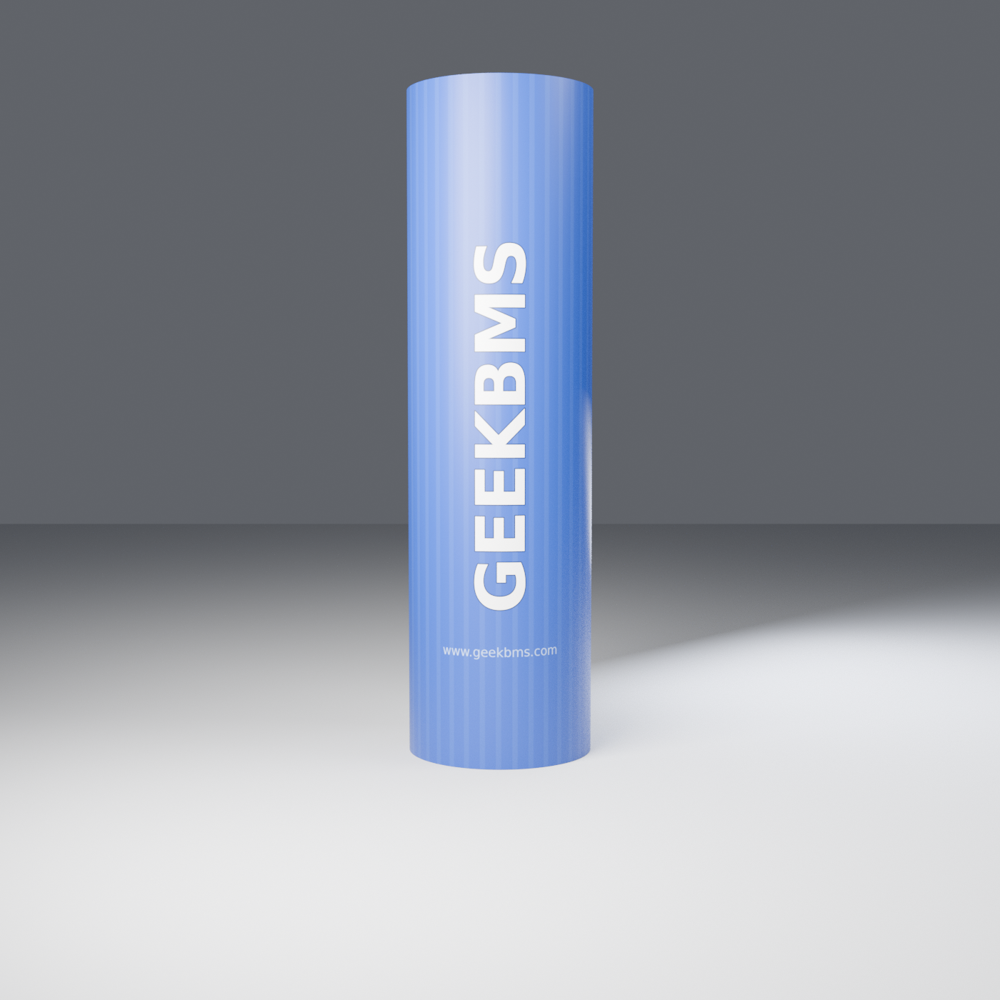
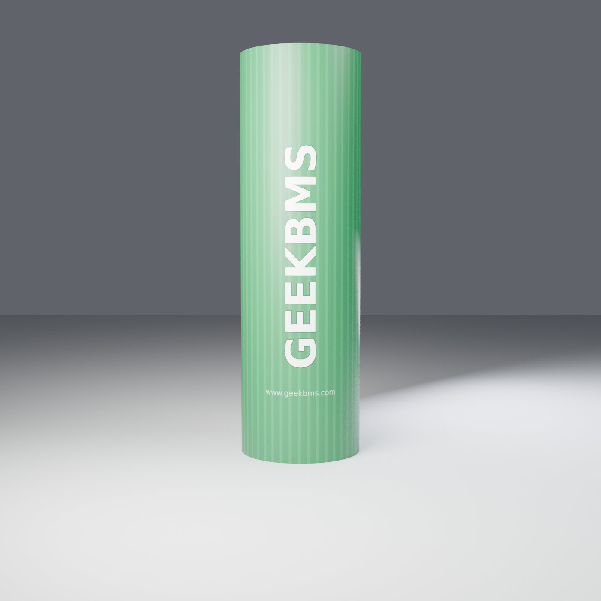
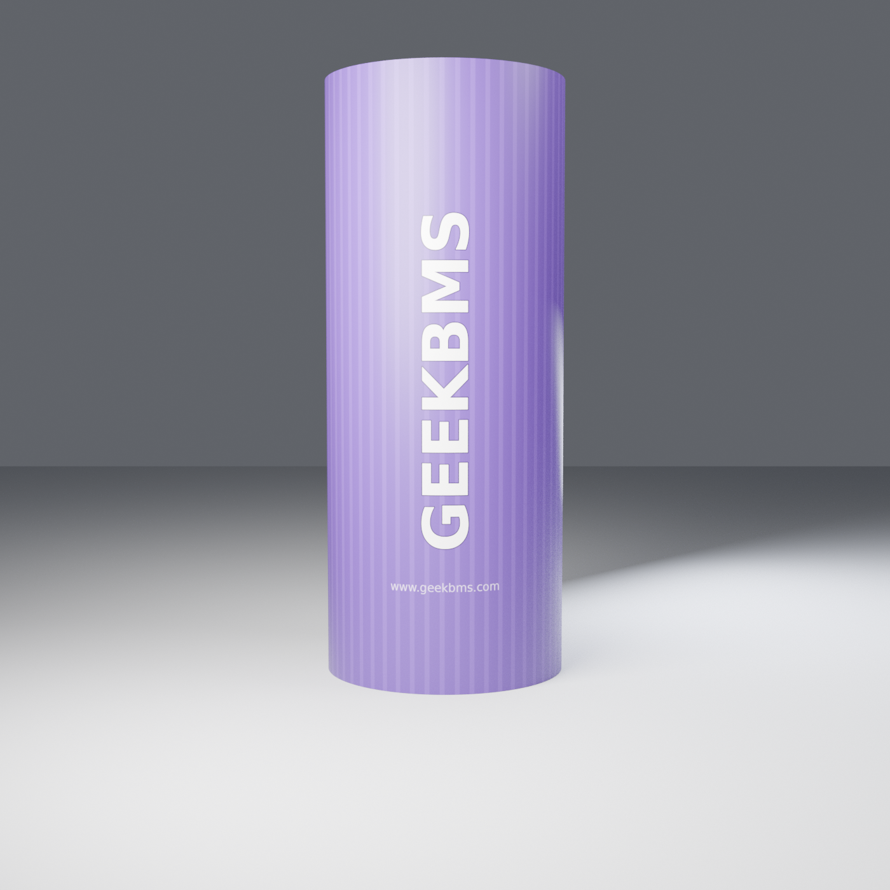
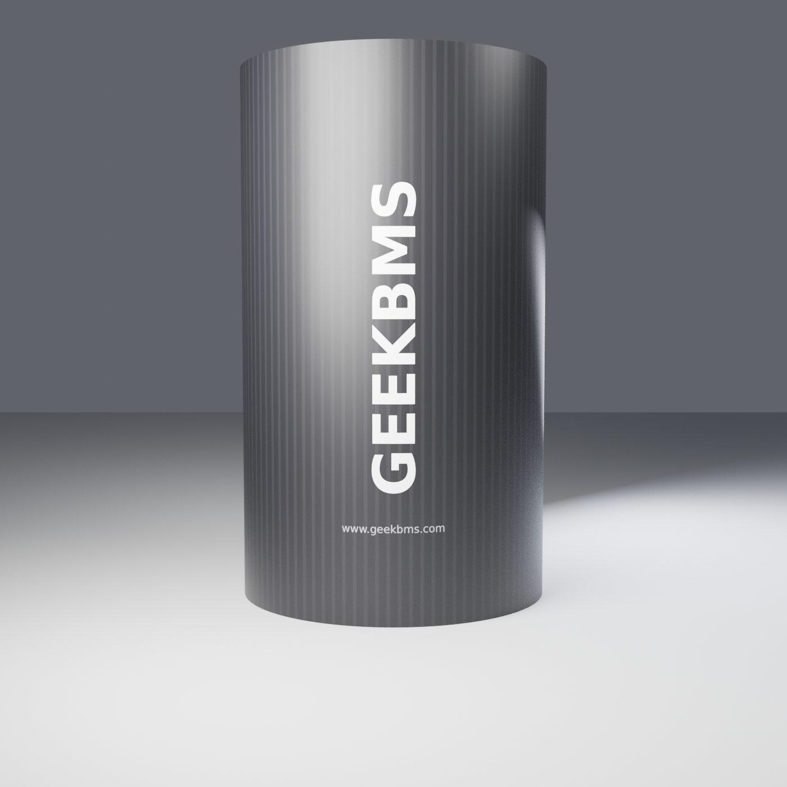
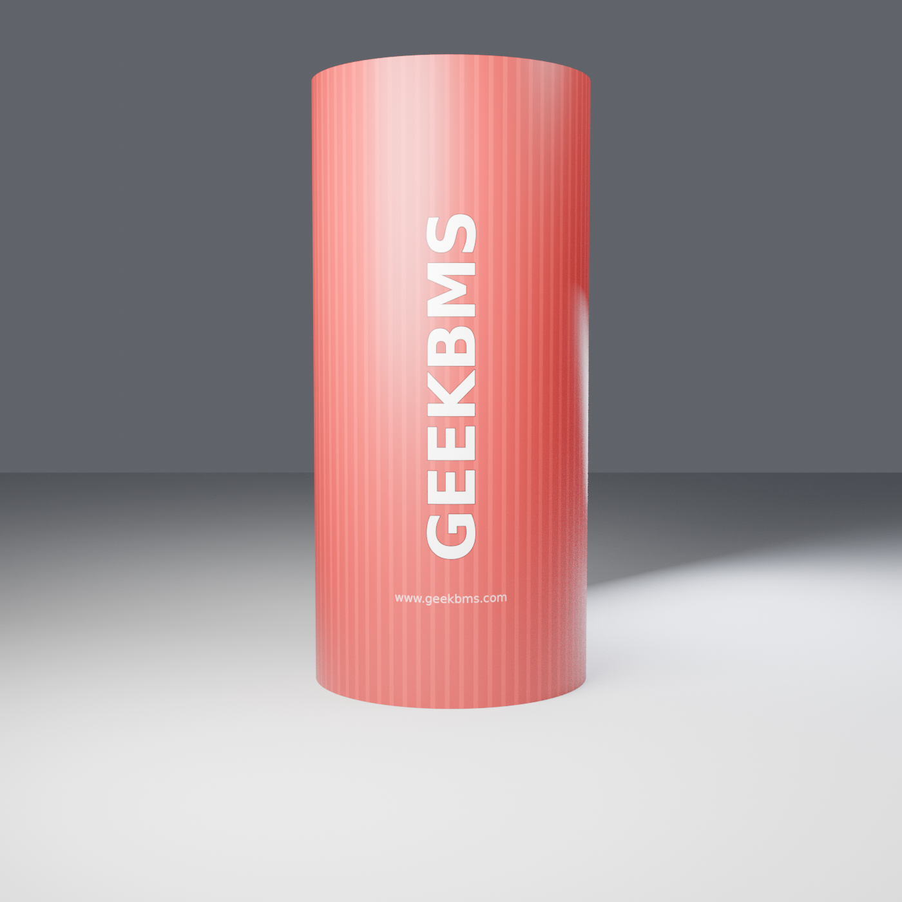
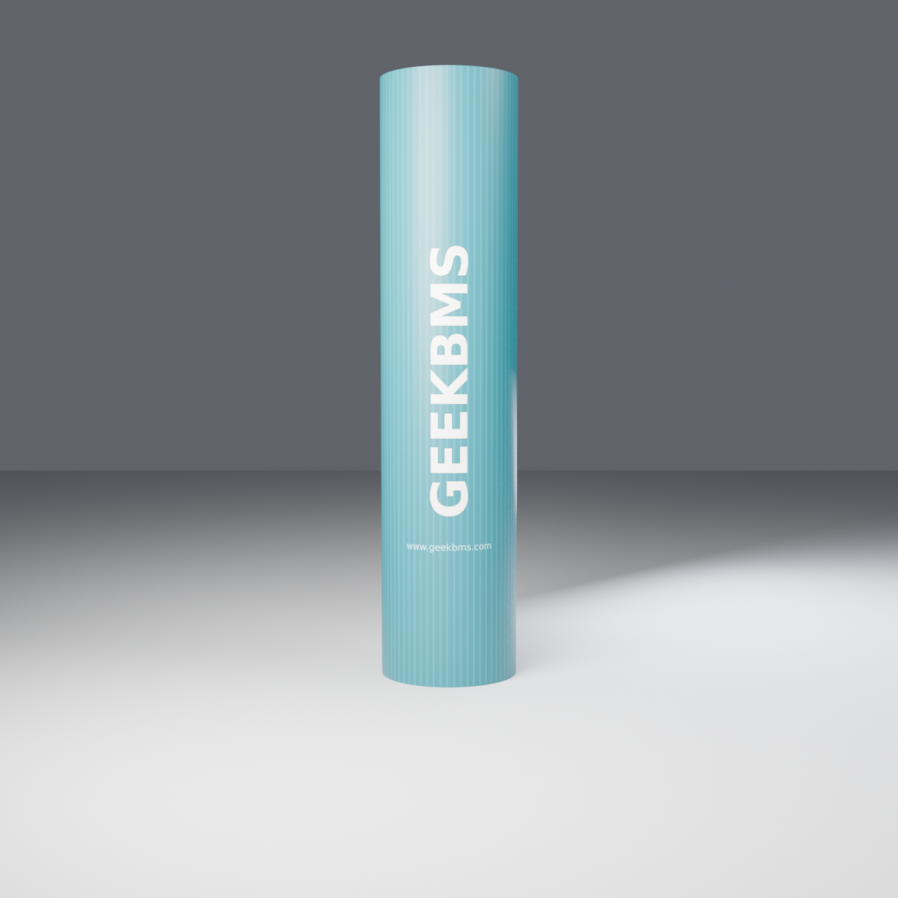
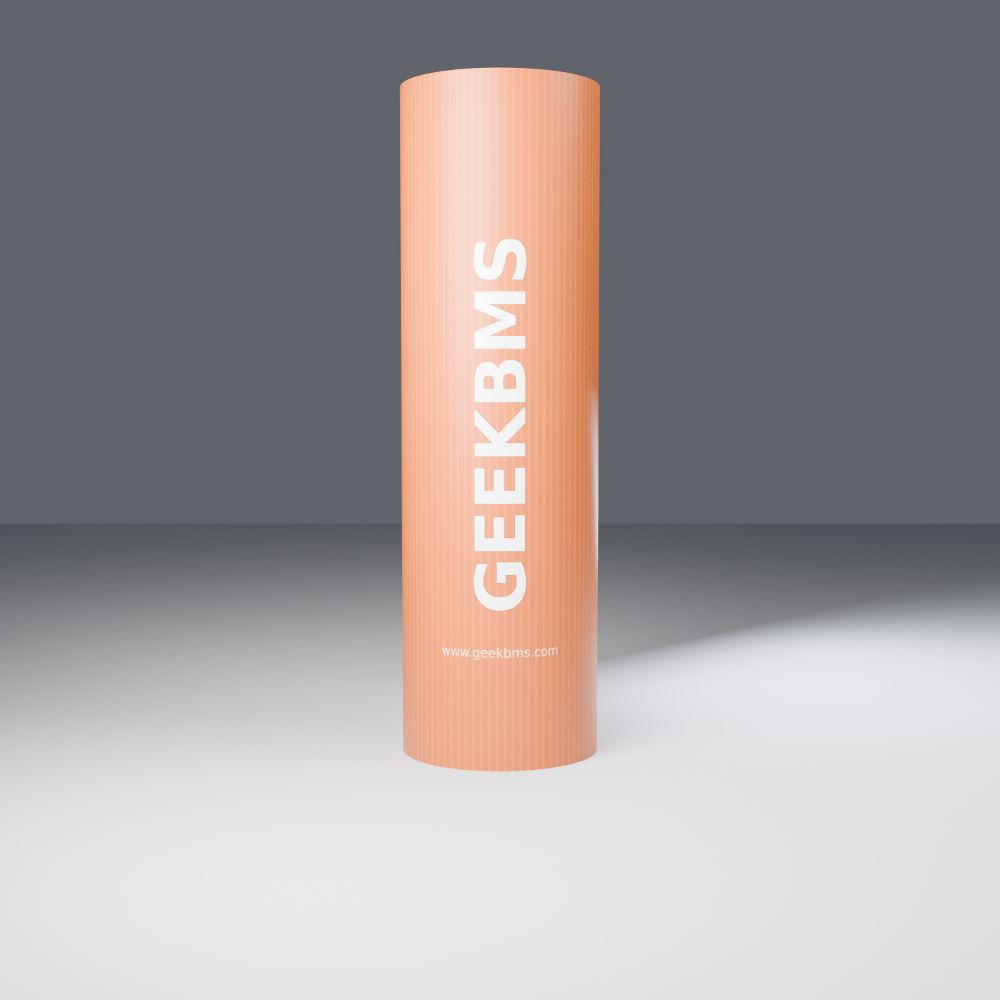

# GEEKBMS Cell Models

Free, community-use 3D models of common **cylindrical Li-ion cells** for pack, fixture and BMS enclosure layout — 18650, 21700, 26650, 4680, 32700, 32140, 40135.

> **Disclaimer（外形参考，非品牌公差副本）**
> These are **simplified exterior shape references** at nominal envelopes. They are **not** copies of any manufacturer's CAD, artwork, trademarks or tolerance drawings. Real cells vary by maker and model (see [Dimension notes](#dimension-notes)). Always check the datasheet of the actual cell before freezing a design. Not for manufacturing, certification or safety-critical use.

## Plan A — what is in each file

| Deliverable | Purpose | Branding |
|---|---|---|
| `cells/<spec>/<spec>_geekbms.step` | **Clean CAD solid** (CadQuery / OpenCascade) for assembly, mates, clearance checks | **None** — the STEP has no text, silkscreen or label geometry, so OD and end-flat datums stay clean |
| `cells/<spec>/<spec>_geekbms.glb` | **Textured 3D model** (Blender, glTF 2.0) for visualization, web viewers, renders | GEEKBMS + `www.geekbms.com` printed on the PVC wrap **as a texture** (embedded) |
| `preview/<spec>.png` | **Blender Cycles render** of the same model | Same wrap texture |

Branding is purely visual (texture), never solid geometry. The wrap shows a vertical **GEEKBMS** mark reading along the cell axis (bottom → top) and the footer **www.geekbms.com**. Wrap colors are stylized “mainstream” cell colors; no third-party logos.

## Specs

| Spec | Ø × H (mm) | Wrap | STEP | GLB |
|------|-----------|------|------|-----|
| 18650 | 18 × 65  | blue   | [18650_geekbms.step](cells/18650/18650_geekbms.step) | [18650_geekbms.glb](cells/18650/18650_geekbms.glb) |
| 21700 | 21 × 70  | green  | [21700_geekbms.step](cells/21700/21700_geekbms.step) | [21700_geekbms.glb](cells/21700/21700_geekbms.glb) |
| 26650 | 26 × 65  | purple | [26650_geekbms.step](cells/26650/26650_geekbms.step) | [26650_geekbms.glb](cells/26650/26650_geekbms.glb) |
| 4680  | 46 × 80  | black  | [4680_geekbms.step](cells/4680/4680_geekbms.step)    | [4680_geekbms.glb](cells/4680/4680_geekbms.glb) |
| 32700 | 32 × 70  | red    | [32700_geekbms.step](cells/32700/32700_geekbms.step) | [32700_geekbms.glb](cells/32700/32700_geekbms.glb) |
| 32140 | 32 × 140 | teal   | [32140_geekbms.step](cells/32140/32140_geekbms.step) | [32140_geekbms.glb](cells/32140/32140_geekbms.glb) |
| 40135 | 40 × 135 | orange | [40135_geekbms.step](cells/40135/40135_geekbms.step) | [40135_geekbms.glb](cells/40135/40135_geekbms.glb) |

Ø = wrap OD; H = overall height from negative end flat to top of positive button. Machine-readable metadata (button size, body height, colors, validated bbox): [`catalog.yaml`](catalog.yaml).

## Renders

| 18650 | 21700 | 26650 | 4680 |
|:---:|:---:|:---:|:---:|
|  |  |  |  |
| Ø18 × 65 | Ø21 × 70 | Ø26 × 65 | Ø46 × 80 |

| 32700 | 32140 | 40135 |
|:---:|:---:|:---:|
|  |  |  |
| Ø32 × 70 | Ø32 × 140 | Ø40 × 135 |

Renders are framed per cell (camera scales with cell size), so image size does not compare cells to each other. Use the dimensions.

## Coordinate system

**STEP (mm):**

- Units: **millimetres**.
- Origin: on the cell axis, at the **negative-end flat** (`z = 0`).
- **+Z → positive terminal.** Button top is at `z = H`.
- Cylinder axis = Z. In the Blender scene the GEEKBMS mark faces **+X**.

```
        +Z (positive terminal / button, z = H)
         ↑
         │   ┌─────┐
         │ ┌─┴─────┴─┐  ← positive shoulder (z = H − button height)
         │ │    G    │
         │ │    E    │  ← GEEKBMS texture on wrap (GLB/PNG only)
         │ │    E    │
         │ │    K…   │
         │ └─────────┘
         ○────────────→ +X
        z = 0  negative end flat (datum)
```

Assembly datums kept clean: **cylinder OD**, **negative end flat** (`z = 0`), **positive shoulder plane**.

**GLB:** same geometry and origin, but in glTF 2.0 conventions: units are **metres** (Ø18 mm → 0.018) and **+Y is up** (glTF +Y = STEP +Z). Blender, three.js, Windows 3D Viewer etc. import it at true scale. The GLB envelope matches the STEP bounding box.

## Naming rules

- Directory: `cells/<spec>/`
- Files: `<spec>_geekbms.step`, `<spec>_geekbms.glb`
- Render: `preview/<spec>.png`
- Spec token = common size code (`18650` = Ø18 × 65.0 mm; `4680` = Ø46 × 80 mm; `32140` = Ø32 × 140 mm).

## Git LFS

`.step`, `.stp` and `.glb` files are stored with **Git LFS** (see `.gitattributes`). Install Git LFS first, or a plain clone gives you small pointer files instead of models:

```bash
git lfs install
git clone https://github.com/GEEKBMS/cell-models.git
cd cell-models && git lfs pull
```

Single files can also be downloaded from the GitHub web UI (the “Download raw file” button resolves LFS).

## Geometry notes (what is stylized)

Included (exterior only): PVC/heat-shrink wrap body at the nominal OD, shallow wrap-tuck grooves near both ends, a negative-end rim cue, a positive insulator ring, and a positive button terminal.

Not included: jelly roll, tabs, CID, vents, can crimp detail, tabless-electrode features (4680), or manufacturer-specific terminals. LFP 32700/32140/40135 cells often ship with screw or wide flat terminals; here they get a simple button. Model your exact terminal from the datasheet if it matters.

## Dimension notes

- All models use the **nominal envelopes** in the table (the size code), with no deviation in the published files.
- Real cells are usually slightly larger than nominal. Typical 18650s are about Ø18.3–18.6 × 65.0–65.3 mm; 21700s about Ø21.1–21.5 × 70.0–70.8 mm; 32700s about Ø32.2–32.4 × 70.0–71.0 mm; and 4680s about Ø46 × 80 mm ±0.5 mm. Protected or button-top retail cells can be several mm longer. Add your own clearance.
- Positive button size and insulator ring size are stylized estimates (`catalog.yaml`), not datasheet values.

## Regenerating

```bash
# 1) Clean STEP + catalog.yaml (Python with cadquery>=2.4, e.g. pip install cadquery)
python scripts/make_cells.py

# 2) Wrap decal textures — use SYSTEM python3 + Pillow (Blender's bundled PIL has broken font metrics)
python3 scripts/blender/make_wrap_decal.py            # -> build/decals/<spec>_wrap_decal.png

# 3) Blender 4.3 Cycles renders + textured GLB
blender --background --python scripts/blender/render_cells.py -- --samples 128 --res 1400
```

The shared spec table is in `scripts/specs.py`. Renders use Cycles on the CPU with denoising off (Debian's Blender build has no OpenImageDenoise). With 128 samples at 1400², each spec takes about 35–50 s on 8 cores.

## License

MIT — see [`LICENSE`](LICENSE). “GEEKBMS” is the project's own mark. Wrap colors are generic, and the models are not affiliated with any cell manufacturer.
